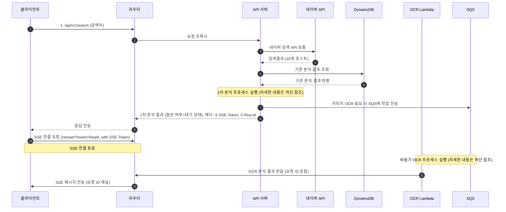
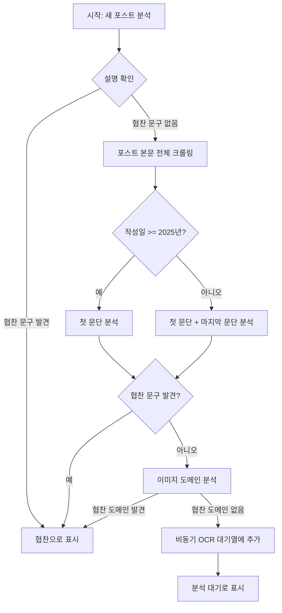
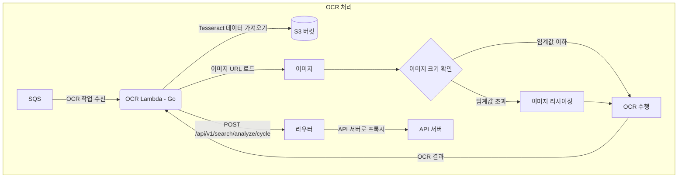
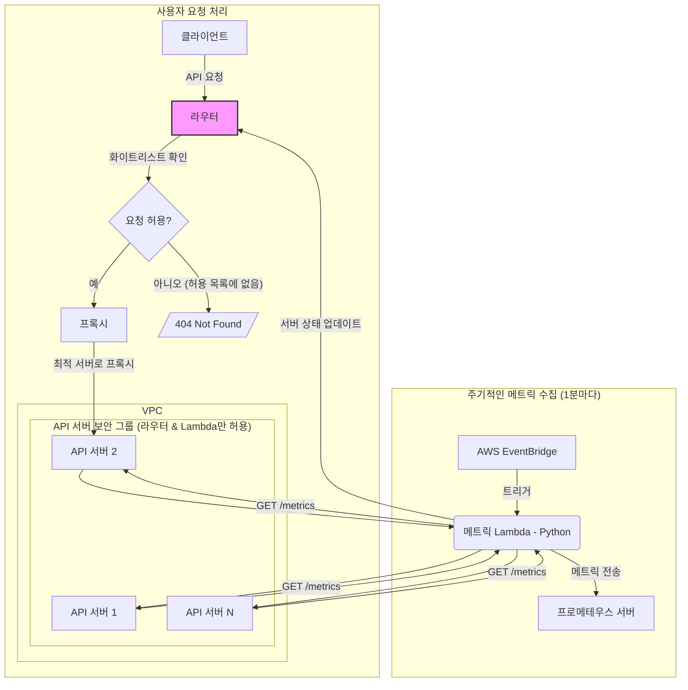

# NDNS (내돈내산) Project

NDNS는 네이버 블로그 검색 결과에 포함된 수많은 포스트 중에서, 사용자가 광고나 협찬이 아닌 순수한 정보성 콘텐츠를 찾을 수 있도록 돕는 시스템입니다. 다단계 분석 파이프라인을 통해 포스트의 광고성 여부를 판별하고, 실시간에 가까운 협찬 여부 분석 결과를 제공하는 것을 목표로 합니다.

👉 **서비스 바로가기**: [https://www.ndns.site](https://ndns.site)

## 🚀 주요 기능 (Key Features)

-   **실시간 분석**: 네이버 검색 API를 통해 얻은 블로그 포스트를 실시간으로 분석합니다.
-   **다단계 탐지 로직**: 포스트의 텍스트, HTML 구조, 이미지 등 다양한 요소를 종합하여 정확하게 광고성 콘텐츠를 판별합니다.
-   **비동기 업데이트**: 초기 분석 후 이미지 OCR과 같이 시간이 소요되는 작업은 비동기적으로 처리되며, Server-Sent Events(SSE)를 통해 클라이언트에 점진적으로 업데이트된 결과를 전송합니다.
-   **확장 가능한 아키텍처**: Go 기반의 API 서버와 AWS Lambda, SQS, DynamoDB 등 클라우드 네이티브 기술을 활용하여 트래픽 변화에 유연하게 대응할 수 있도록 설계되었습니다.

## ⚙️ 전체 시스템 아키텍처 (Overall System Architecture)

클릭하여 전체 시스템 아키텍처 보기

## 🔬 1차 분석 프로세스 (Initial Analysis Process)

클릭하여 1차 분석 프로세스 보기

## 🖼️ OCR 아키텍처 (OCR Architecture)

클릭하여 OCR 아키텍처 보기

## 🌐 라우팅 및 헬스체크 아키텍처 (Routing & Health Check Architecture)

클릭하여 라우팅 및 헬스체크 아키텍처 보기

### 보안 강화 (Security Enhancements)

1.  **라우터 레벨 접근 제어 (Nginx Whitelist)**
    *   `Router` 서버(Nginx)는 사전에 정의된 API 엔드포인트(e.g., `/api/v1/search`)에 대한 요청만 허용하는 **화이트리스트** 기반으로 동작합니다.
    *   화이트리스트에 존재하지 않는 모든 경로로의 요청은 `404 Not Found`로 처리되어, 불필요한 내부 시스템 접근을 원천적으로 차단합니다.

2.  **네트워크 레벨 접근 제어 (AWS Security Group)**
    *   각 `API Server`는 **라우터 서버**와 **AWS Lambda**의 IP 주소에서 오는 트래픽만 허용하도록 AWS 보안 그룹(Security Group)이 설정되어 있습니다.
    *   이를 통해 라우터를 우회하여 API 서버에 직접 접근하는 것을 막아 시스템의 보안을 강화합니다.

## 🛠️ 기술 스택 (Tech Stack)

-   **Backend**: Go
-   **Automation (Lambda)**: Go, Python
-   **API**: REST, Server-Sent Events (SSE)
-   **Cloud Services**: AWS Lambda, SQS, DynamoDB, S3, EventBridge
-   **Infrastructure**: Docker, Nginx
-   **CI/CD**: GitHub Actions
