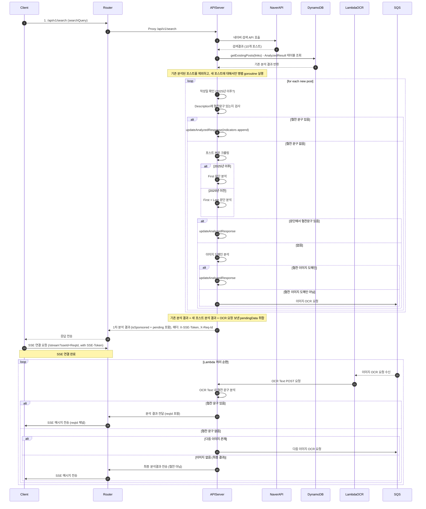
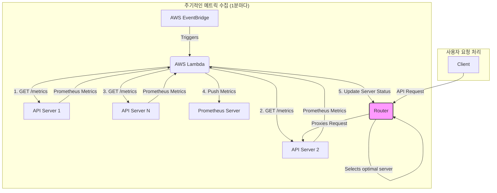

# NDNS (내돈내산) Project

안녕하세요! NDNS 프로젝트에 오신 것을 환영합니다.

NDNS는 네이버 블로그 검색 결과에 포함된 수많은 포스트 중에서, 사용자가 광고나 협찬이 아닌 순수한 정보성 콘텐츠를 찾을 수 있도록 돕는 시스템입니다. 다단계 분석 파이프라인을 통해 포스트의 광고성 여부를 판별하고, 실시간에 가까운 분석 결과를 제공하는 것을 목표로 합니다.

## 🚀 주요 기능 (Key Features)

-   **실시간 분석**: 네이버 검색 API를 통해 얻은 블로그 포스트를 실시간으로 분석합니다.
-   **다단계 탐지 로직**: 포스트의 텍스트, HTML 구조, 이미지 등 다양한 요소를 종합하여 정확하게 광고성 콘텐츠를 판별합니다.
-   **비동기 업데이트**: 초기 분석 후 이미지 OCR과 같이 시간이 소요되는 작업은 비동기적으로 처리되며, Server-Sent Events(SSE)를 통해 클라이언트에 점진적으로 업데이트된 결과를 전송합니다.
-   **확장 가능한 아키텍처**: Go 기반의 API 서버와 AWS Lambda, SQS, DynamoDB 등 클라우드 네이티브 기술을 활용하여 트래픽 변화에 유연하게 대응할 수 있도록 설계되었습니다.

## ⚙️ 시스템 아키텍처 (System Architecture)

아래 다이어그램은 NDNS의 핵심 동작 방식을 보여줍니다. 클라이언트의 검색 요청부터 시작하여, 내부 서버의 분석 과정과 비동기적인 OCR 처리 후 최종 결과를 받기까지의 전체 흐름을 나타냅니다.

## 🌐 라우팅 및 헬스체크 아키텍처 (Routing & Health Check Architecture)

NDNS는 단순한 라운드 로빈 방식이 아닌, 각 API 서버의 실제 부하와 상태를 기반으로 지능적인 라우팅을 수행합니다. 이를 통해 특정 서버의 과부하를 방지하고 사용자에게 최상의 응답성을 제공합니다. 아래 다이어그램은 이 과정을 설명합니다.

1.  **주기적인 상태 수집**: `AWS EventBridge`가 1분마다 `AWS Lambda` 함수를 트리거합니다.
2.  **메트릭 수집**: `Lambda` 함수는 실행 중인 모든 `API Server`의 `/metrics` 엔드포인트에 접근하여 Prometheus 형식의 메트릭(CPU, 메모리 사용량, 응답 시간 등)을 수집합니다.
3.  **메트릭 전송 및 저장**: 수집된 메트릭은 장기적인 모니터링 및 분석을 위해 중앙 `Prometheus Server`로 전송됩니다.
4.  **라우터 상태 갱신**: 동시에, `Lambda`는 수집한 메트릭을 `Router` 서버로 직접 전달합니다.
5.  **최적 서버 판단**: `Router`는 전달받은 메트릭을 기반으로 현재 가장 부하가 적고 응답성이 좋은 '최적의 API 서버' 목록을 실시간으로 갱신합니다.
6.  **지능형 프록시**: 클라이언트로부터 API 요청이 들어오면, `Router`는 이 목록을 참조하여 가장 최적의 `API Server`로 요청을 프록시합니다.

## 🛠️ 기술 스택 (Tech Stack)

-   **Backend**: Go
-   **API**: REST, Server-Sent Events (SSE)
-   **Cloud Services**: AWS Lambda, SQS, DynamoDB
-   **Infrastructure**: Docker, Nginx
-   **CI/CD**: GitHub Actions
