# NDNS (내돈내산) Project

안녕하세요! 내돈내산 프로젝트에 오신 것을 환영합니다.

NDNS는 네이버 블로그 검색 결과에 포함된 수많은 포스트 중에서, 사용자가 광고나 협찬이 아닌 순수한 정보성 콘텐츠를 찾을 수 있도록 돕는 서비스입니다. 다단계 분석 파이프라인을 통해 포스트의 광고성 여부를 판별하고, 실시간에 가까운 분석 결과를 제공하는 것을 목표로 합니다.

## 🚀 주요 기능 (Key Features)

-   **실시간 분석**: 네이버 검색 API를 통해 얻은 블로그 포스트를 실시간으로 분석합니다.
-   **다단계 탐지 로직**: 포스트의 텍스트, HTML 구조, 이미지 등 다양한 요소를 종합하여 정확하게 광고성 콘텐츠를 판별합니다.
-   **비동기 업데이트**: 초기 분석 후 이미지 OCR과 같이 시간이 소요되는 작업은 비동기적으로 처리되며, Server-Sent Events(SSE)를 통해 클라이언트에 점진적으로 업데이트된 결과를 전송합니다.
-   **확장 가능한 아키텍처**: Go 기반의 API 서버와 AWS Lambda, SQS, DynamoDB 등 클라우드 네이티브 기술을 활용하여 트래픽 변화에 유연하게 대응할 수 있도록 설계되었습니다.

## ⚙️ 시스템 아키텍처 (System Architecture)

아래 다이어그램은 NDNS의 핵심 동작 방식을 보여줍니다. 클라이언트의 검색 요청부터 시작하여, 내부 서버의 분석 과정과 비동기적인 OCR 처리 후 최종 결과를 받기까지의 전체 흐름을 나타냅니다.

```mermaid
sequenceDiagram
    autonumber
    participant Client
    participant Router
    participant APIServer
    participant NaverAPI
    participant DynamoDB
    participant LambdaOCR
    participant SQS

    Client->>Router: 1. /api/v1/search (searchQuery)
    Router->>APIServer: Proxy /api/v1/search
    APIServer->>NaverAPI: 네이버 검색 API 호출
    NaverAPI-->>APIServer: 검색결과 (10개 포스트)

    APIServer->>DynamoDB: getExistingPosts(links) - AnalyzedResult 테이블 조회
    DynamoDB-->>APIServer: 기존 분석 결과 반환

    note over APIServer: 기존 분석된 포스트를 제외하고, 새 포스트에 대해서만 병렬 goroutine 실행

    loop for each new post
        APIServer->>APIServer: 작성일 확인 (2025년 이후?)
        APIServer->>APIServer: Description에 협찬문구 있는지 검사
        alt 협찬 문구 있음
            APIServer->>APIServer: updateAnalyzedResponse(indicators append)
        else 협찬 문구 없음
            APIServer->>APIServer: 포스트 본문 크롤링

            alt 2025년 이후
                APIServer->>APIServer: First 문단 분석
            else 2025년 이전
                APIServer->>APIServer: First + Last 문단 분석
            end

            alt 문단에서 협찬문구 있음
                APIServer->>APIServer: updateAnalyzedResponse
            else 없음
                APIServer->>APIServer: 이미지 도메인 분석
                alt 협찬 이미지 도메인
                    APIServer->>APIServer: updateAnalyzedResponse
                else 협찬 이미지 도메인 아님
                    APIServer->>SQS: 이미지 OCR 요청
                end
            end
        end
    end

    note over APIServer: 기존 분석 결과 + 새 포스트 분석 결과 + OCR 요청 보낸 pendingData 취합

    APIServer-->>Router: 1차 분석 결과 (isSponsored + pending 포함), 헤더: X-SSE-Token, X-Req-Id
    Router-->>Client: 응답 전송

    Client->>Router: SSE 연결 요청 (/stream?sseId=ReqId, with SSE-Token)
    note over Client, Router: SSE 연결 완료

    loop Lambda 처리 순환
        SQS-->>LambdaOCR: 이미지 OCR 요청 수신
        LambdaOCR->>APIServer: OCR Text POST 요청
        APIServer->>APIServer: OCR Text 내 협찬 문구 분석

        alt 협찬 문구 있음
            APIServer->>Router: 분석 결과 전달 (reqId 포함)
            Router->>Client: SSE 메시지 전송 (reqId 채널)
        else 협찬 문구 없음
            alt 다음 이미지 존재
                APIServer->>SQS: 다음 이미지 OCR 요청
            else 이미지 없음 (최종 결과)
                APIServer->>Router: 최종 분석결과 전송 (협찬 아님)
                Router->>Client: SSE 메시지 전송
            end
        end
    end
```

## 🛠️ 기술 스택 (Tech Stack)

-   **Backend**: Go
-   **API**: REST, Server-Sent Events (SSE)
-   **Cloud Services**: AWS Lambda, SQS, DynamoDB
-   **Infrastructure**: Docker, Nginx
-   **CI/CD**: GitHub Actions
